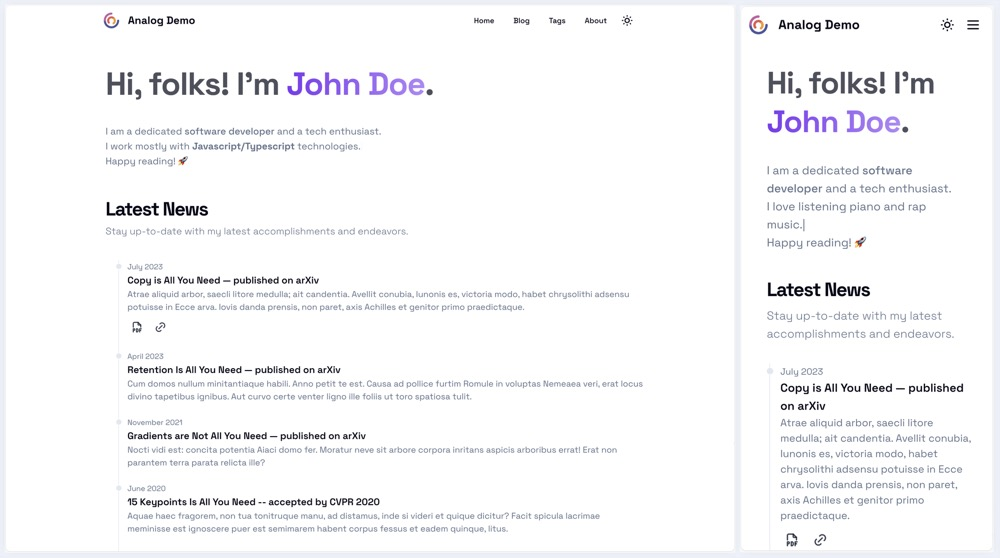

# Analog: Another (Academic) Blog Starter

**Analog** is a out-of-the-box feature-rich blog template with [Next.js](https://nextjs.org).

It is easy to customize and reconfigure to suit your needs. It is perfect for individual blogs, especially **academic or technology blogs**.

Demo sites:
- [Analog Demo](https://analog-demo.zhutmost.com)
- [zhutmost.com](https://blog.zhutmost.com) - My personal blog.

Check out the documentation below to get started.

## 🚀 Quick Start

### Prerequisites

[Node.js](https://nodejs.org/en) and [Yarn v2](https://yarnpkg.com) are required to run this project.

```shell
# MacOS
brew install node # install Node.js > 20
corepack enable # enable corepack (which includes Yarn v2)
```

### Kickstart Your Blog

```shell
git clone git@github.com:zhutmost/analog-blog-starter.git my-blog
cd my-blog
yarn dev # start the development server
```

Then, open [http://localhost:3000](http://localhost:3000) to see your own blog.

### Begin Writing

Add your blog posts in Markdown in the `content/posts` directory. Note that the file extension should be `.mdx` (rather than `.md`).

Like other example posts, you have to add some metadata to the top of the file:

```markdown
---
title: Image Demo
datePublish: 2020-01-01
summary: This is a test post for images.
category: 'Lift Style'
banner: /images/posts/image-test/banner.jpg
tags: ['life', 'tech', 'javascript']
---
# Write your content here ... 
```

### Customize Your Blog

See the [Documentation](https://analog-demo.zhutmost.com/category/doc) to learn how to customize your blog.

## 🎁 Features

### TODO List

- [x] Search
- [x] Comment
- [x] RSS
- [x] Sitemap
- [ ] Code highlighting optimization 
- [ ] Page-wise greeting message
- [ ] SEO optimization
- [ ] Team Page
- [ ] License
- [ ] GitHub contribution wall on Author Page
- [ ] Better Emoji support

### Code Highlighting

TODO

### Responsive Design

Give your audiences best viewing experience with the mobile-friendly responsive layout.



## 🎉 Issues and Feature Requests

If you find any bugs in my code or have any ideas to improve this, please feel free to open an [issue](https://github.com/zhutmost/analog-blog-starter). I will be glad to join the discussion.
