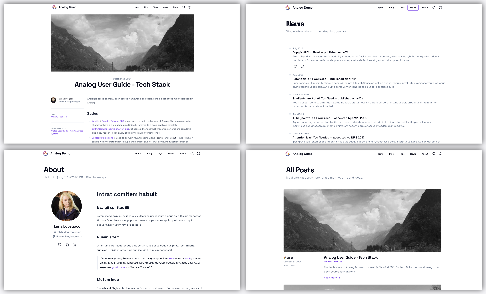

# Analog: Another (Academic) Blog Starter

A out-of-the-box feature-rich blog template with [Next.js](https://nextjs.org).

It is easy to customize and reconfigure to suit your needs. It is perfect for individual blogs, especially **academic or technology blogs**.

**Live Preview**:
- [Analog Demo](https://analog-demo.zhutmost.com)
- [zhutmost.com](https://blog.zhutmost.com) - My personal blog.

Check out the documentation below to get started.

## 🚀 Quick Start

[](https://vercel.com/new/clone?repository-url=https%3A%2F%2Fgithub.com%2Fzhutmost%2Fanalog-blog-starter&project-name=analog-blog&repository-name=analog-blog&demo-title=Analog%20Blog%20Demo&demo-description=Demo%20Blog%20(i.e.%2C%20Docs%20site)%20of%20the%20Analog%20Bolog%20Starter&demo-url=https%3A%2F%2Fanalog-demo.zhutmost.com&demo-image=https%3A%2F%2Fgithub.com%2Fzhutmost%2Fanalog-blog-starter%2Fraw%2Fmain%2Fimg%2Fcover.png)

Click it and follow its steps! You will get your own blog in minutes.

To modify the blog, clone the repository and follow the instructions below.

### Prerequisites

[Node.js](https://nodejs.org/en) and [Yarn v2](https://yarnpkg.com) are required to run this project.

```shell
# MacOS
brew install node # install Node.js > 20
corepack enable # enable corepack (which includes Yarn v2)
```

### Kickstart Your Blog

```shell
git clone git@github.com:YOUR-USERNAME/YOUR-BLOG.git my-blog
cd my-blog
yarn dev # start the development server locally
```

Then, open [http://localhost:3000](http://localhost:3000) to see your own blog.

### Begin Writing

Add your blog posts in Markdown in the `content/posts` directory. Note that the file extension should be `.mdx` (rather than `.md`).

Like other example posts, you have to add some metadata to the top of the file:

```markdown
---
title: Image Demo
datePublish: 2020-01-01
summary: This is a test post for images.
category: 'Lift Style'
banner: /images/posts/image-test/banner.jpg
tags: ['life', 'tech', 'javascript']
---
# Write your content here ...
```

After any changes, the blog will automatically update [http://localhost:3000](http://localhost:3000). To make the changes public, push the changes to your repository.

### Customize Your Blog

See the [Documentation](https://analog-demo.zhutmost.com/category/docs) to learn how to customize your blog.

## 🎁 Features

Analog includes plentiful search, comment, sharing and other plugins out of the box that makes your blog feature-rich and powerful.

- [**Fully Responsive Design**](#responsive-design)
- [**Dark & Light Mode Switching**](#dark--light-mode)
- [**Diverse Pages**](#diverse-pages)

  Tags · Category · Team · About · News
- **Style-rich Writing**

  MDX (Markdown + JSX) · Katex (math support) · highlighting.js (code highlighting) · License
- [**Comment System**](https://analog-demo.zhutmost.com/post/docs/comment)

  Giscus · Utterances · Disqus
- **Built-in Search**

  KBar (support Cmd+K shortcuts, including pages & posts)
- [**Analytics**](https://analog-demo.zhutmost.com/post/docs/analytics)

  Umami · Posthog · Google Analytics · Plausible · Simple Analytics
- **Other**

  RSS · Sitemap · SEO (OpenGraph + Twitter Card)

### Responsive Design

Give your audiences best viewing experience with the mobile-friendly responsive layout.


### Dark & Light Mode

Make your blog more comfortable to read with the dark/light mode switching.


### Diverse Pages

In addition to the blog posts, Analog provides various pages to enrich your blog.



## 🎉 Issues & Feature Requests

If you find any bugs in my code or have any ideas to improve this, please feel free to open an [issue](https://github.com/zhutmost/analog-blog-starter). I will be glad to join the discussion.

## 💡 Inspiration

This project is on the shoulder of giants. See [Tech Stack](https://analog-demo.zhutmost.com/posts/docs/tech-stack) for more details.
